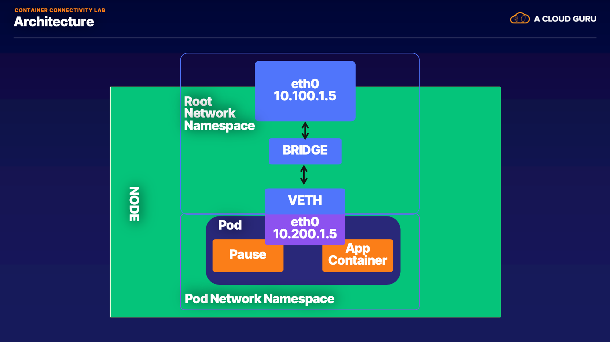

# Container connectivity 

### Objectives
1. Deploy kind cluster  
2. Understand iptables role in connectivity 
3. Investigate services and pods connectivity
4. Inspect network primitives and map them to pods



### Linux commands 

* [ip netns](http://man7.org/linux/man-pages/man8/ip-netns.8.html)
* [ip](http://man7.org/linux/man-pages/man8/ip.8.html)
* [docker exec](https://docs.docker.com/engine/reference/commandline/container_exec/)
* [kubectl exec](https://kubernetes.io/docs/reference/generated/kubectl/kubectl-commands#exec)

### Setup Steps

* Docker running
* Deploy kind cluster
* Deploy pods
* Deploy services

1. Check to make sure docker is running

```bash
docker version 
```
```bash
 2020-03-06 19:13:25 ⌚  strongjz-macbook in ~
   ○ → docker version
   Client: Docker Engine - Community
    Version:           19.03.5
    API version:       1.40
    Go version:        go1.12.12
    Git commit:        633a0ea
    Built:             Wed Nov 13 07:22:34 2019
    OS/Arch:           darwin/amd64
    Experimental:      false
   
   Server: Docker Engine - Community
    Engine:
     Version:          19.03.5
     API version:      1.40 (minimum version 1.12)
     Go version:       go1.12.12
     Git commit:       633a0ea
     Built:            Wed Nov 13 07:29:19 2019
     OS/Arch:          linux/amd64
     Experimental:     false
    containerd:
     Version:          v1.2.10
     GitCommit:        b34a5c8af56e510852c35414db4c1f4fa6172339
    runc:
     Version:          1.0.0-rc8+dev
     GitCommit:        3e425f80a8c931f88e6d94a8c831b9d5aa481657
    docker-init:
     Version:          0.18.0
     GitCommit:        fec3683
```

2. Start kind cluster 

```bash
kind create cluster --config kind.yml --name iptables
```
```bash
± |master {1} S:5 U:4 ?:1 ✗| → kind create cluster --config kind.config --name iptables
Creating cluster "iptables" ...
 ✓ Ensuring node image (kindest/node:v1.16.3) 🖼
 ✓ Preparing nodes 📦
 ✓ Writing configuration 📜
 ✓ Starting control-plane 🕹️
 ✓ Installing CNI 🔌
 ✓ Installing StorageClass 💾
 ✓ Joining worker nodes 🚜
Set kubectl context to "kind-iptables"
You can now use your cluster with:

kubectl cluster-info --context kind-iptables

Have a nice day! 👋
```

3. Deploy lab pods

```bash 
kubectl apply -f curl1.yml
```
```bash
kubectl apply -f curl2.yml
```
```bash
 2020-03-06 19:01:52 ⌚  strongjz-macbook in ~/Documents/code/acg_ad_net_k8_aws_presentation/CH02/CH02_LC05
± |master {1} S:5 U:4 ?:1 ✗| → kubectl apply -f curl1.yml
deployment.apps/curl1 created

 2020-03-06 19:02:02 ⌚  strongjz-macbook in ~/Documents/code/acg_ad_net_k8_aws_presentation/CH02/CH02_LC05
± |master {1} S:5 U:4 ?:1 ✗| → kubectl apply -f curl2.yml
deployment.apps/curl2 created

```
4. Deploy lab services 

```bash
kubectl apply echo-service.yml 
```
```bash
± |master {1} S:5 U:4 ?:1 ✗| → kubectl apply -f echo-service.yml
deployment.apps/echo unchanged
service/echo-service created
```

5. Verify Pods and services are up and running
```bash 
kubectl get pods,svc,ep
```

```bash
± |master {1} S:5 U:4 ?:1 ✗| → kubectl get pods,svc,ep
NAME                         READY   STATUS    RESTARTS   AGE
pod/curl1-647585685b-5pdj4   1/1     Running   0          6s
pod/curl2-5cb57995cd-jqdbg   1/1     Running   0          6s
pod/echo-669c78484d-df45k    1/1     Running   0          6s
pod/echo-669c78484d-ps5v5    1/1     Running   0          6s
pod/echo-669c78484d-vkpt9    1/1     Running   0          6s

NAME                   TYPE        CLUSTER-IP     EXTERNAL-IP   PORT(S)   AGE
service/echo-service   ClusterIP   10.102.117.8   <none>        80/TCP    6s
service/kubernetes     ClusterIP   10.96.0.1      <none>        443/TCP   19m

NAME                     ENDPOINTS                                         AGE
endpoints/echo-service   10.244.1.2:5678,10.244.2.4:5678,10.244.3.2:5678   6s
endpoints/kubernetes     172.17.0.4:6443                                   19m

```

### Inspection 

* View veth pair and match with pod
* View network namespace and match with pod
* Verify pids on node match pods
* Match services with iptables rules

1. View the bridge and veths for the pods on the node 

Get the nodes the pod are on 

```bash
kubectl get pods -o wide
```
```bash
 2020-03-06 20:10:46 ⌚  strongjz-macbook in ~
○ → kubectl get pods -o wide
NAME                     READY   STATUS    RESTARTS   AGE   IP           NODE               NOMINATED NODE   READINESS GATES
curl1-647585685b-5pdj4   1/1     Running   0          35m   10.244.2.2   iptables-worker3   <none>           <none>
curl2-5cb57995cd-jqdbg   1/1     Running   0          35m   10.244.2.3   iptables-worker3   <none>           <none>
echo-669c78484d-df45k    1/1     Running   0          35m   10.244.2.4   iptables-worker3   <none>           <none>
echo-669c78484d-ps5v5    1/1     Running   0          35m   10.244.1.2   iptables-worker    <none>           <none>
echo-669c78484d-vkpt9    1/1     Running   0          35m   10.244.3.2   iptables-worker2   <none>           <none>
```

Pod curl1-647585685b-5pdj4 is running on node iptables-worker3 

2. Pick the kind worker node 

```bash
docker ps
```

```bash
 2020-03-06 20:17:00 ⌚  strongjz-macbook in ~
○ → docker ps
CONTAINER ID        IMAGE                  COMMAND                  CREATED             STATUS              PORTS                       NAMES
ba80dcf042da        kindest/node:v1.16.3   "/usr/local/bin/entr…"   56 minutes ago      Up 56 minutes       127.0.0.1:52942->6443/tcp   iptables-control-plane
3acb04045545        kindest/node:v1.16.3   "/usr/local/bin/entr…"   56 minutes ago      Up 56 minutes                                   iptables-worker2
31c3d31fed34        kindest/node:v1.16.3   "/usr/local/bin/entr…"   56 minutes ago      Up 56 minutes                                   iptables-worker3
0204de74f428        kindest/node:v1.16.3   "/usr/local/bin/entr…"   56 minutes ago      Up 56 minutes                                   iptables-worker                           iptables-worker
```

Run Exec on the worker node

3. List out interfaces

on the Kind node exec ip a

```bash
docker exec -it iptables-worker3 ip a
```

```bash
± |master {1} S:5 U:4 ?:1 ✗| → docker exec -it iptables-worker3 ip a
1: lo: <LOOPBACK,UP,LOWER_UP> mtu 65536 qdisc noqueue state UNKNOWN group default qlen 1000
    link/loopback 00:00:00:00:00:00 brd 00:00:00:00:00:00
    inet 127.0.0.1/8 scope host lo
       valid_lft forever preferred_lft forever
2: tunl0@NONE: <NOARP> mtu 1480 qdisc noop state DOWN group default qlen 1000
    link/ipip 0.0.0.0 brd 0.0.0.0
3: ip6tnl0@NONE: <NOARP> mtu 1452 qdisc noop state DOWN group default qlen 1000
    link/tunnel6 :: brd ::
4: veth81ebcd7c@if5: <BROADCAST,MULTICAST,UP,LOWER_UP> mtu 1500 qdisc noqueue state UP group default
    link/ether 3a:f7:b7:a1:56:ac brd ff:ff:ff:ff:ff:ff link-netns cni-82a7f4a5-ab4a-1a0e-b76c-31be43b08bde
    inet 10.244.2.1/32 brd 10.244.2.1 scope global veth81ebcd7c
       valid_lft forever preferred_lft forever
5: veth135e50fd@if5: <BROADCAST,MULTICAST,UP,LOWER_UP> mtu 1500 qdisc noqueue state UP group default
    link/ether ce:1a:0d:d5:11:0d brd ff:ff:ff:ff:ff:ff link-netns cni-727b1199-66da-2c59-d337-f683b3ce8fcd
    inet 10.244.2.1/32 brd 10.244.2.1 scope global veth135e50fd
       valid_lft forever preferred_lft forever
6: eth0@if7: <BROADCAST,MULTICAST,UP,LOWER_UP> mtu 1500 qdisc noqueue state UP group default
    link/ether 02:42:ac:11:00:02 brd ff:ff:ff:ff:ff:ff link-netnsid 0
    inet 172.17.0.2/16 brd 172.17.255.255 scope global eth0
       valid_lft forever preferred_lft forever
7: veth61c9fd70@if5: <BROADCAST,MULTICAST,UP,LOWER_UP> mtu 1500 qdisc noqueue state UP group default
    link/ether de:65:de:65:a8:3b brd ff:ff:ff:ff:ff:ff link-netns cni-0eeda30c-c02b-a9e0-da5d-c57f5436c307
    inet 10.244.2.1/32 brd 10.244.2.1 scope global veth61c9fd70
       valid_lft forever preferred_lft forever

```

On the curl pod also exec  ip a

```bash
kubectl exec -it curl1-647585685b-5pdj4 ip a
```
```bash
2020-03-06 20:17:45 ⌚  strongjz-macbook in ~
○ → kubectl exec -it curl1-647585685b-5pdj4 ip a
1: lo: <LOOPBACK,UP,LOWER_UP> mtu 65536 qdisc noqueue qlen 1000
  link/loopback 00:00:00:00:00:00 brd 00:00:00:00:00:00
  inet 127.0.0.1/8 scope host lo
     valid_lft forever preferred_lft forever
  inet6 ::1/128 scope host
     valid_lft forever preferred_lft forever
2: tunl0@NONE: <NOARP> mtu 1480 qdisc noop qlen 1000
  link/ipip 0.0.0.0 brd 0.0.0.0
3: ip6tnl0@NONE: <NOARP> mtu 1452 qdisc noop qlen 1000
  link/tunnel6 00:00:00:00:00:00:00:00:00:00:00:00:00:00:00:00 brd 00:00:00:00:00:00:00:00:00:00:00:00:00:00:00:00
5: eth0@if4: <BROADCAST,MULTICAST,UP,LOWER_UP,M-DOWN> mtu 1500 qdisc noqueue
  link/ether 6e:13:e8:42:bb:13 brd ff:ff:ff:ff:ff:ff
  inet 10.244.2.2/24 brd 10.244.2.255 scope global eth0
     valid_lft forever preferred_lft forever
  inet6 fe80::6c13:e8ff:fe42:bb13/64 scope link
     valid_lft forever preferred_lft forever

```
On the Curl pod the interface for eth0 is connected to our veth pair and bridge, in this case that is interface 5 

```bash
5: eth0@if4: <BROADCAST,MULTICAST,UP,LOWER_UP,M-DOWN> mtu 1500 qdisc noqueue
  link/ether 6e:13:e8:42:bb:13 brd ff:ff:ff:ff:ff:ff
  inet 10.244.2.2/24 brd 10.244.2.255 scope global eth0
     valid_lft forever preferred_lft forever
  inet6 fe80::6c13:e8ff:fe42:bb13/64 scope link
     valid_lft forever preferred_lft forever
```     

It also hints at where the interface is located on the kind worker node 
```
eth0@if4
```

This tells us that it's connected to the veth interface 4 on the kind worker node 

From the node ip a

```bash
4: veth81ebcd7c@if5: <BROADCAST,MULTICAST,UP,LOWER_UP> mtu 1500 qdisc noqueue state UP group default
   link/ether 3a:f7:b7:a1:56:ac brd ff:ff:ff:ff:ff:ff link-netns cni-82a7f4a5-ab4a-1a0e-b76c-31be43b08bde
   inet 10.244.2.1/32 brd 10.244.2.1 scope global veth81ebcd7c
      valid_lft forever preferred_lft forever
```

That matches the interface 5 on the pod 

Let's check the Network namespace as well, from the node ip a output 

```bash
cni-82a7f4a5-ab4a-1a0e-b76c-31be43b08bde
```

4. List out the Network namespaces on the node 

```bash
docker exec -it iptables-worker3 /usr/sbin/ip netns list
```

```bash
 2020-03-06 20:28:11 ⌚  strongjz-macbook in ~/Documents/code/acg_ad_net_k8_aws_presentation/CH02/CH02_LC05
± |master {1} S:5 U:4 ?:1 ✗| → docker exec -it iptables-worker3 /usr/sbin/ip netns list
cni-0eeda30c-c02b-a9e0-da5d-c57f5436c307 (id: 3)
cni-727b1199-66da-2c59-d337-f683b3ce8fcd (id: 2)
cni-82a7f4a5-ab4a-1a0e-b76c-31be43b08bde (id: 1)
```

Let's see what process/es run inside that network namespace 

```bash
docker exec -it iptables-worker3 /usr/sbin/ip netns pid cni-727b1199-66da-2c59-d337-f683b3ce8fcd
```
```bash
 2020-03-06 20:29:12 ⌚  strongjz-macbook in ~/Documents/code/acg_ad_net_k8_aws_presentation/CH02/CH02_LC05
± |master {1} S:5 U:4 ?:1 ✗| → docker exec -it iptables-worker3 /usr/sbin/ip netns pid cni-727b1199-66da-2c59-d337-f683b3ce8fcd
2677
2907
2919

```

Let's grep for each process id

```bash
 2020-03-06 20:30:19 ⌚  strongjz-macbook in ~/Documents/code/acg_ad_net_k8_aws_presentation/CH02/CH02_LC05
± |master {1} S:5 U:4 ?:1 ✗| → docker exec -it iptables-worker3 ps aux | grep 2677
root      2677  0.0  0.0   1024     4 ?        Ss   00:41   0:00 /pause

 2020-03-06 20:30:59 ⌚  strongjz-macbook in ~/Documents/code/acg_ad_net_k8_aws_presentation/CH02/CH02_LC05
± |master {1} S:5 U:4 ?:1 ✗| → docker exec -it iptables-worker3 ps aux | grep 2907
root      2907  0.0  0.0   3180   188 ?        Ss   00:41   0:00 sh -c echo Hell

 2020-03-06 20:31:05 ⌚  strongjz-macbook in ~/Documents/code/acg_ad_net_k8_aws_presentation/CH02/CH02_LC05
± |master {1} S:5 U:4 ?:1 ✗| → docker exec -it iptables-worker3 ps aux | grep 2919
root      2919  0.0  0.0   3160   184 ?        S    00:41   0:00 sleep 3600
```

We have the pause container, and the two processes running inside the curl container, echo and sleep

5. Inspecting iptables 

View the iptables on the kind worker node
```bash
docker exec -it iptables-worker3 iptables -L
```

```
± |master {1} S:5 U:4 ?:1 ✗| → docker exec -it iptables-worker3 iptables -L
Chain INPUT (policy ACCEPT)
target     prot opt source               destination
KUBE-SERVICES  all  --  anywhere             anywhere             ctstate NEW /* kubernetes service portals */
KUBE-EXTERNAL-SERVICES  all  --  anywhere             anywhere             ctstate NEW /* kubernetes externally-visible service portals */
KUBE-FIREWALL  all  --  anywhere             anywhere

Chain FORWARD (policy ACCEPT)
target     prot opt source               destination
KUBE-FORWARD  all  --  anywhere             anywhere             /* kubernetes forwarding rules */
KUBE-SERVICES  all  --  anywhere             anywhere             ctstate NEW /* kubernetes service portals */

Chain OUTPUT (policy ACCEPT)
target     prot opt source               destination
KUBE-SERVICES  all  --  anywhere             anywhere             ctstate NEW /* kubernetes service portals */
KUBE-FIREWALL  all  --  anywhere             anywhere

Chain KUBE-EXTERNAL-SERVICES (1 references)
target     prot opt source               destination

Chain KUBE-FIREWALL (2 references)
target     prot opt source               destination
DROP       all  --  anywhere             anywhere             /* kubernetes firewall for dropping marked packets */ mark match 0x8000/0x8000

Chain KUBE-FORWARD (1 references)
target     prot opt source               destination
DROP       all  --  anywhere             anywhere             ctstate INVALID
ACCEPT     all  --  anywhere             anywhere             /* kubernetes forwarding rules */ mark match 0x4000/0x4000
ACCEPT     all  --  10.244.0.0/16        anywhere             /* kubernetes forwarding conntrack pod source rule */ ctstate RELATED,ESTABLISHED
ACCEPT     all  --  anywhere             10.244.0.0/16        /* kubernetes forwarding conntrack pod destination rule */ ctstate RELATED,ESTABLISHED

Chain KUBE-SERVICES (3 references)
target     prot opt source               destination
```

Retrieve the Cluster IP of the echo service

```bash
kubectl get svc
```
```bash
 2020-03-06 19:59:46 ⌚  strongjz-macbook in ~
○ → kubectl get svc
NAME           TYPE        CLUSTER-IP     EXTERNAL-IP   PORT(S)   AGE
echo-service   ClusterIP   10.102.117.8   <none>        80/TCP    22m
kubernetes     ClusterIP   10.96.0.1      <none>        443/TCP   41m
```

Now use the cluster ip of the service to find our iptables rule. 

```bash
docker exec -it iptables-worker3 iptables -L -t nat | grep 10.102.117.8
```
```bash
 2020-03-06 20:33:34 ⌚  strongjz-macbook in ~/Documents/code/acg_ad_net_k8_aws_presentation/CH02/CH02_LC05
± |master {1} S:5 U:4 ?:1 ✗| → docker exec -it iptables-worker3 iptables -L -t nat | grep 10.102.117.8
KUBE-MARK-MASQ  tcp  -- !10.244.0.0/16        10.102.117.8         /* default/echo-service: cluster IP */ tcp dpt:80
KUBE-SVC-7VVRITHJKDZHDQAD  tcp  --  anywhere             10.102.117.8         /* default/echo-service: cluster IP */ tcp dpt:80
```

List out all the rules on the chain KUBE-SVC-7VVRITHJKDZHDQAD

```bash
docker exec -it iptables-worker3 iptables -L KUBE-SVC-7VVRITHJKDZHDQAD -t nat
```

```bash
± |master {1} S:5 U:4 ?:1 ✗| → docker exec -it iptables-worker3 iptables -L KUBE-SVC-7VVRITHJKDZHDQAD -t nat
Chain KUBE-SVC-7VVRITHJKDZHDQAD (1 references)
target     prot opt source               destination
KUBE-SEP-U2LTPJXAZEM2OQET  all  --  anywhere             anywhere             statistic mode random probability 0.33332999982
KUBE-SEP-AANMSM6QVJW3JS2Y  all  --  anywhere             anywhere             statistic mode random probability 0.50000000000
KUBE-SEP-NXPMRYPPF5OQRY2M  all  --  anywhere             anywhere
```

All of the endpoints for the services are map to these chains

* KUBE-SEP-U2LTPJXAZEM2OQET
* KUBE-SEP-AANMSM6QVJW3JS2Y
* KUBE-SEP-NXPMRYPPF5OQRY2M

Now we can see what the rules for this chain are
```bash
docker exec -it iptables-worker3 iptables -L KUBE-SEP-U2LTPJXAZEM2OQET -t nat
```

```bash
± |master {1} S:5 U:4 ?:1 ✗| → docker exec -it iptables-worker3 iptables -L KUBE-SEP-U2LTPJXAZEM2OQET -t nat
Chain KUBE-SEP-U2LTPJXAZEM2OQET (1 references)
target     prot opt source               destination
KUBE-MARK-MASQ  all  --  10.244.1.2           anywhere
DNAT       tcp  --  anywhere             anywhere             tcp to:10.244.1.2:5678
```

10.244.1.2:5678 is one of the services endpoints, aka a pod backing the service

```bash
○ → kubectl describe ep echo-service
Name:         echo-service
Namespace:    default
Labels:       <none>
Annotations:  endpoints.kubernetes.io/last-change-trigger-time: 2020-03-07T00:41:34Z
Subsets:
  Addresses:          10.244.1.2,10.244.2.4,10.244.3.2
  NotReadyAddresses:  <none>
  Ports:
    Name     Port  Protocol
    ----     ----  --------
    <unset>  5678  TCP

Events:  <none>
```


