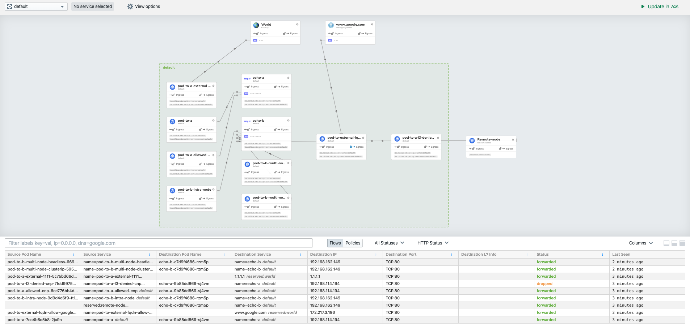

# Overlay Network Lab

### Objectives
1. Deploy EKS Cluster
2. Deploy Cilium CNI 
3. Verify deployment

### Prereq
1. [Eksctl installed](CH01/CH01_L05)
2. [AWS IAM authenticator](https://docs.aws.amazon.com/eks/latest/userguide/install-aws-iam-authenticator.html)  
3. [Helm installed](https://helm.sh/docs/intro/install/)
4. [AWS Account with credentials for CLI](https://docs.aws.amazon.com/cli/latest/userguide/cli-chap-configure.html)

### Setup Steps
1. Deploy Cluster
2. Disable the aws-node DaemonSet
3. Deploy Cilium 
4. Validate Install
5. Deploy Hubble

### 1. Deploy Cluster

```bash
eksctl create cluster -n test-cluster -N 0
```

Output
```bash
[ℹ]  eksctl version 0.12.0
[ℹ]  using region us-west-2
[ℹ]  setting availability zones to [us-west-2b us-west-2c us-west-2d]
[ℹ]  subnets for us-west-2b - public:192.168.0.0/19 private:192.168.96.0/19
[ℹ]  subnets for us-west-2c - public:192.168.32.0/19 private:192.168.128.0/19
[ℹ]  subnets for us-west-2d - public:192.168.64.0/19 private:192.168.160.0/19
[ℹ]  nodegroup "ng-b06b606b" will use "ami-0c13bb9cbfd007e56" [AmazonLinux2/1.14]
[ℹ]  using Kubernetes version 1.14
[ℹ]  creating EKS cluster "test-cluster" in "us-west-2" region with un-managed nodes
[ℹ]  will create 2 separate CloudFormation stacks for cluster itself and the initial nodegroup
[ℹ]  if you encounter any issues, check CloudFormation console or try 'eksctl utils describe-stacks --region=us-west-2 --cluster=test-cluster'
[ℹ]  CloudWatch logging will not be enabled for cluster "test-cluster" in "us-west-2"
[ℹ]  you can enable it with 'eksctl utils update-cluster-logging --region=us-west-2 --cluster=test-cluster'
[ℹ]  Kubernetes API endpoint access will use default of {publicAccess=true, privateAccess=false} for cluster "test-cluster" in "us-west-2"
[ℹ]  2 sequential tasks: { create cluster control plane "test-cluster", create nodegroup "ng-b06b606b" }
[ℹ]  building cluster stack "eksctl-test-cluster-cluster"
[ℹ]  deploying stack "eksctl-test-cluster-cluster"
```
### 2. Disable the aws-node DaemonSet


```bash
kubectl -n kube-system set image daemonset/aws-node aws-node=docker.io/spaster/alpine-sleep
```

This is only for ENI Mode, Cilium will act as the eni provisioner for EC2 and not AWS CNI. 

https://docs.cilium.io/en/v1.7/concepts/ipam/eni/


## 3. Deploy Cilium 

#### 3.1 Add helm repo to Cilium 

```bash
helm repo add cilium https://helm.cilium.io/
```

#### 3.2 Deploy Cilium

```bash
helm install cilium cilium/cilium --version 1.7.1 \
  --namespace kube-system \
  --set global.eni=true \
  --set global.egressMasqueradeInterfaces=eth0 \
  --set global.tunnel=disabled \
  --set global.nodeinit.enabled=true
```
Output 
```bash
NAME: cilium
LAST DEPLOYED: Wed Mar 25 12:04:18 2020
NAMESPACE: kube-system
STATUS: deployed
REVISION: 1
TEST SUITE: None

```
#### 3.3 Scale up the cluster 

Get the node group for our cluster

```bash
eksctl get nodegroup --cluster test-cluster 
```
Output
```bash
CLUSTER         NODEGROUP       CREATED                 MIN SIZE        MAX SIZE        DESIRED CAPACITY        INSTANCE TYPE   IMAGE ID
test-cluster    ng-b06b606b     2020-03-25T15:33:04Z    0               0               0                       m5.large        ami-0c13bb9cbfd007e56

```

Scale up that node group 

```bash
eksctl scale nodegroup --cluster test-cluster -n ng-b06b606b -N 3
```

```bash
[ℹ]  scaling nodegroup stack "eksctl-test-cluster-nodegroup-ng-b06b606b" in cluster eksctl-test-cluster-cluster
[ℹ]  scaling nodegroup, desired capacity from "0" to 3, max size from "0" to 3
```
### 4. Validate Install

#### 4.1 Wait for all components to come up

```bash
kubectl -n kube-system get pods --watch
``` 
Output
```bash
NAME                               READY   STATUS    RESTARTS   AGE
aws-node-r2z4t                     1/1     Running   0          69s
aws-node-zcw6j                     1/1     Running   0          73s
aws-node-zg4c9                     1/1     Running   0          68s
cilium-2sctp                       1/1     Running   0          73s
cilium-fmwkh                       1/1     Running   0          67s
cilium-gvlgc                       1/1     Running   0          69s
cilium-node-init-lz86q             1/1     Running   0          73s
cilium-node-init-vb67p             1/1     Running   0          69s
cilium-node-init-vg9k4             1/1     Running   0          67s
cilium-operator-6b7ff6dd5c-94cwm   1/1     Running   0          5m13s
coredns-84549585c-qspml            1/1     Running   0          39m
coredns-84549585c-rd8jc            1/1     Running   0          39m
kube-proxy-j7wdv                   1/1     Running   0          69s
kube-proxy-r44dj                   1/1     Running   0          68s
kube-proxy-wlzl9                   1/1     Running   0          73s
```
#### 4.2 Connectivity Test 

```bash 
kubectl apply -f ./connectivity-check.yaml
```
Output
```bash
service/echo-a created
deployment.apps/echo-a created
service/echo-b created
service/echo-b-headless created
deployment.apps/echo-b created
deployment.apps/host-to-b-multi-node-clusterip created
deployment.apps/host-to-b-multi-node-headless created
deployment.apps/pod-to-a-allowed-cnp created
ciliumnetworkpolicy.cilium.io/pod-to-a-allowed-cnp created
deployment.apps/pod-to-a-l3-denied-cnp created
ciliumnetworkpolicy.cilium.io/pod-to-a-l3-denied-cnp created
deployment.apps/pod-to-a created
deployment.apps/pod-to-b-intra-node created
deployment.apps/pod-to-b-multi-node-clusterip created
deployment.apps/pod-to-b-multi-node-headless created
deployment.apps/pod-to-a-external-1111 created
deployment.apps/pod-to-external-fqdn-allow-google-cnp created
ciliumnetworkpolicy.cilium.io/pod-to-external-fqdn-allow-google-cnp created
```

### 5. Deploy Hubble

Hubble relies on on aggregation of events in the eBPF datapath of Cilium. Please enable datapath aggregation by setting the value of monitor-aggregation in the cilium-config ConfigMap to medium or higher:

monitor-aggregation: medium

#### 5.1  Verify the setting `monitor-aggregation` is set to medium by opening the configmap for cilium config

```bash
kubectl edit configmap cilium-config -n kube-system
``` 

#### 5.2 Deploy Hubble

```bash
kubectl apply -f ./hubble.yml
```

#### 5.3 Access Hubble UI

```bash
export NAMESPACE=kube-system
export POD_NAME=$(kubectl get pods --namespace $NAMESPACE -l "k8s-app=hubble-ui" -o jsonpath="{.items[0].metadata.name}")
kubectl --namespace $NAMESPACE port-forward $POD_NAME 12000
``` 

Navigate to localhost:12000 in your browser


