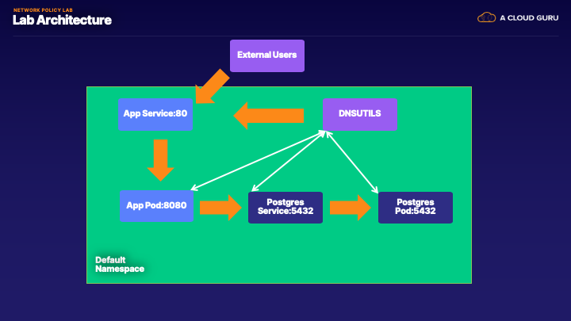

# Securing the Network with Network Policies

### Objectives
1. Secure application and database traffic

### Prereq
1. Cluster running with Cilium installed

### Setup Steps
1. Deploy EKS Cluster 

2. Deploy Pods and Services for testing

3. Test Connectivity 

4. Deploy Network Policies 

### Architecture 



### 1. Deploy EKS Cluster 

If the cluster from Lecture 4 is not running, walk through the Deployment from [Ch03_L04 - Setting up an overlay network](../CH03_L04)
 
Delete the connectivity Test if you deployed it from the previous lab 
```bash
kubectl delete deployment echo-a echo-b host-to-b-multi-node-clusterip host-to-b-multi-node-headless pod-to-a \
pod-to-a-allowed-cnp pod-to-a-external-1111 pod-to-a-l3-denied-cnp pod-to-a-l3-denied-cnp pod-to-b-intra-node \
pod-to-b-multi-node-clusterip pod-to-b-multi-node-headless pod-to-external-fqdn-allow-google-cnp
```
```bash
kubectl delete svc echo-a echo-b echo-b-headless
``` 
```bash
kubectl delete ciliumnetworkpolicy pod-to-a-allowed-cnp pod-to-a-l3-denied-cnp pod-to-external-fqdn-allow-google-cnp
```

### 2. Deploy Pods and Services for testing

2.1 Deploy Database pods

```bash
kubectl apply -f database.yml 
```

2.2  Deploy Application Pods 

```bash
kubectl apply -f app.yml 
```

2.3 Deploy Dns Utils pod 

```bash
kubectl apply -f dnsutils.yml
```


2.4 Check to make sure the app and database came up 

```bash
kubectl get pods
```

Output 
```bash
○ → kubectl get pods
NAME                   READY   STATUS    RESTARTS   AGE
app-5fc49498f6-wdzfj   1/1     Running   0          2m12s
dnsutils               1/1     Running   0          6m6s
postgres-0             1/1     Running   0          13m
```

### 3. Test Connectivity

Layer 3 Test

Get Pod IP's 
```bash
○ → kubectl get pods -o wide
NAME                   READY   STATUS    RESTARTS   AGE     IP                NODE                                           NOMINATED NODE   READINESS GATES
app-5fc49498f6-wdzfj   1/1     Running   0          2m51s   192.168.106.38    ip-192-168-22-20.us-west-2.compute.internal    <none>           <none>
dnsutils               1/1     Running   0          6m45s   192.168.168.219   ip-192-168-73-65.us-west-2.compute.internal    <none>           <none>
postgres-0             1/1     Running   0          14m     192.168.48.129    ip-192-168-40-250.us-west-2.compute.internal   <none>           <none>
```

Ping test
```bash
kubectl exec -it dnsutils -- ping 192.168.106.38
```


Using Netcat let's scan the App and Admin Port

```bash
kubectl exec -it dnsutils -- nc -z -vv 192.168.106.38 8080
192.168.106.38 (192.168.106.38:8080) open
sent 0, rcvd 0

kubectl exec -it dnsutils -- nc -z -vv 192.168.106.38 8090
192.168.106.38 (192.168.106.38:8090) open
sent 0, rcvd 0
```

Test connectivity to App API ping 

```bash
kubectl exec -it dnsutils -- wget -qO- app:80/ping
{"message":"pong"}
```

Test connectivity to App API secret 

```bash
kubectl exec -it dnsutils -- wget -qO- app:80/secret
{"message":"You should not see this"} 
```

Test connectivity to Database

```bash
kubectl exec -it dnsutils -- nc -z -vv postgres 5432
postgres (10.100.120.235:5432) open
sent 0, rcvd 0
```

Test connection to App to Database
```bash
kubectl exec -it dnsutils -- wget -qO- app:80/data
{"message":"Database Connected"}
```

Test connectivity to App API Admin 
```bash
kubectl exec -it dnsutils -- wget -qO- app:8090/admin
{"message":"Admin Sections"} 
```

### 3. Deploy Network Policies

Deploy cilium Layer 3 policy

```bash
kubectl apply -f layer_3_netpol.yml
```

Test connectivity Direct access to the database again 
```bash
kubectl exec -it dnsutils -- nc -w 5 -z -vv postgres 5432
nc: postgres (10.100.120.235:5432): Operation timed out
sent 0, rcvd 0
command terminated with exit code 1
```

But the app still works
```bash
kubectl exec -it dnsutils -- wget -qO- app:80/data
{"message":"Database Connected"}
```

Deploy cilium Layer 4 policy

```bash
kubectl apply -f layer_4_netpol.yml
```

8080 is still open but not 8090

```bash
kubectl exec -it dnsutils -- nc -z -vv 192.168.106.38 8080
192.168.106.38 (192.168.106.38:8080) open
sent 0, rcvd 0

kubectl exec -it dnsutils -- nc -w 5 -z -vv 192.168.106.38 8090
nc: 192.168.120.119 (192.168.106.38:8090): Operation timed out
command terminated with exit code 1
```


Deploy cilium Layer 7 policy

```bash
kubectl apply -f layer_7_netpol.yml
```

Test connectivity to app api pong and slash 

```bash
kubectl exec -it dnsutils -- wget -qO- -T 5 app:80/
{"message":"Default Page"}
```

```bash
kubectl exec -it dnsutils -- wget -qO- -T 5 app:80/ping
{"message":"pong"}
```

Test connectivity to app api data endpoint 

```bash
kubectl exec -it dnsutils -- wget -qO- -T 5 app:80/data
wget: download timed out
command terminated with exit code 1
```

Finished! 

We will use this Cluster for the Troubleshooting DNS Lab in Lecture 7


 
