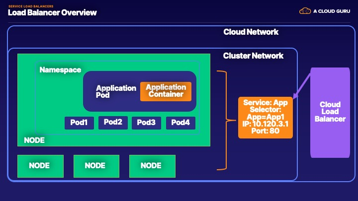

# Services Load Balancer Lab



### Objectives
1. Deploy EKS Cluster
2. Deploy Applications
3. Deploy and Test Service Loadbalancer

### Prereq
1. Deploy an EKS Cluster 

### Setup Steps

1. Deploy EKS Cluster 

```bash
eksctl create cluster -N 3
[ℹ]  eksctl version 0.12.0
[ℹ]  using region us-west-2
[ℹ]  setting availability zones to [us-west-2c us-west-2d us-west-2b]
[ℹ]  subnets for us-west-2c - public:192.168.0.0/19 private:192.168.96.0/19
[ℹ]  subnets for us-west-2d - public:192.168.32.0/19 private:192.168.128.0/19
[ℹ]  subnets for us-west-2b - public:192.168.64.0/19 private:192.168.160.0/19
[ℹ]  nodegroup "ng-e7e094a6" will use "ami-0c13bb9cbfd007e56" [AmazonLinux2/1.14]
[ℹ]  using Kubernetes version 1.14
[ℹ]  creating EKS cluster "attractive-sculpture-1587846638" in "us-west-2" region with un-managed nodes
[ℹ]  will create 2 separate CloudFormation stacks for cluster itself and the initial nodegroup
[ℹ]  if you encounter any issues, check CloudFormation console or try 'eksctl utils describe-stacks --region=us-west-2 --cluster=attractive-sculpture-1587846638'
[ℹ]  CloudWatch logging will not be enabled for cluster "attractive-sculpture-1587846638" in "us-west-2"
[ℹ]  you can enable it with 'eksctl utils update-cluster-logging --region=us-west-2 --cluster=attractive-sculpture-1587846638'
[ℹ]  Kubernetes API endpoint access will use default of {publicAccess=true, privateAccess=false} for cluster "attractive-sculpture-1587846638" in "us-west-2"
[ℹ]  2 sequential tasks: { create cluster control plane "attractive-sculpture-1587846638", create nodegroup "ng-e7e094a6" }
[ℹ]  building cluster stack "eksctl-attractive-sculpture-1587846638-cluster"
[ℹ]  deploying stack "eksctl-attractive-sculpture-1587846638-cluster"
```

### 2. Deploy Application Pods 

```bash
kubectl apply -f app.yml,database.yml,dnsutils.yml
```
```bash
service/app-test-service created
deployment.apps/app unchanged
service/postgres unchanged
configmap/postgres-config unchanged
statefulset.apps/postgres configured
pod/dnsutils unchanged
```

Verify the Applications is up and running

We will test the, host, ping and data routes of the example application

We deployed a test service of type cluster ip 
```bash 
kubectl exec -it dnsutils -- wget -qO- app-test-service:80/host
```

```bash
{"message":"NODE: ip-192-168-81-157.us-west-2.compute.internal, POD IP:192.168.77.156"}
```        

```bash
kubectl exec -it dnsutils -- wget -qO- app-test-service:80/ping
```
```bash
{"message":"pong"}
```

Verify the Database Stateful is reachable
```bash
kubectl exec -it dnsutils -- wget -qO- app-test-service:80/data
```
```bash
{"message":"Database Connected"}
```

### 3. Deploy Service Load Balancer

```bash
kubectl apply -f service.yml
```
```bash
service/loadbalancer-service created
```

There should be a Service Deployed with an External IP

```bash
kubectl get svc
```

```bash
NAME                   TYPE           CLUSTER-IP      EXTERNAL-IP                                                              PORT(S)                       AGE
app-test-service       ClusterIP      10.100.59.5     <none>                                                                   80/TCP                        4m50s
kubernetes             ClusterIP      10.100.0.1      <none>                                                                   443/TCP                       36m
loadbalancer-service   LoadBalancer   10.100.155.60   a08ca5d40873a11eaa1d606b2a3d6519-425878804.us-west-2.elb.amazonaws.com   80:32687/TCP,8090:31273/TCP   10s
postgres               ClusterIP      10.100.151.61   <none>                         
                                          5432/TCP                      7m10s
```

### 4. Test External Connectivity

```bash
wget -qO- a08ca5d40873a11eaa1d606b2a3d6519-425878804.us-west-2.elb.amazonaws.com/
{"message":"Default Page"}

wget -qO- a08ca5d40873a11eaa1d606b2a3d6519-425878804.us-west-2.elb.amazonaws.com/ping
{"message":"pong"}

wget -qO- a08ca5d40873a11eaa1d606b2a3d6519-425878804.us-west-2.elb.amazonaws.com/data
{"message":"Database Connected"}

 wget -qO- a08ca5d40873a11eaa1d606b2a3d6519-425878804.us-west-2.elb.amazonaws.com/host

{"message":"NODE: ip-192-168-81-157.us-west-2.compute.internal, POD IP:192.168.77.156"}
```

Since we define the Admin port in the Service, it is also reachable

```bash
wget -qO- a08ca5d40873a11eaa1d606b2a3d6519-425878804.us-west-2.elb.amazonaws.com:8090/admin
{"message":"Admin Sections"}
```

You can see the ELB that was created in AWS along with the Nodeports 
```bash
aws elb describe-load-balancers --name a08ca5d40873a11eaa1d606b2a3d6519
```

```bash
{
    "LoadBalancerDescriptions": [
        {
            "LoadBalancerName": "a08ca5d40873a11eaa1d606b2a3d6519",
            "DNSName": "a08ca5d40873a11eaa1d606b2a3d6519-425878804.us-west-2.elb.amazonaws.com",
            "CanonicalHostedZoneName": "a08ca5d40873a11eaa1d606b2a3d6519-425878804.us-west-2.elb.amazonaws.com",
            "CanonicalHostedZoneNameID": "Z1H1FL5HABSF5",
            "ListenerDescriptions": [
                {
                    "Listener": {
                        "Protocol": "TCP",
                        "LoadBalancerPort": 8090,
                        "InstanceProtocol": "TCP",
                        "InstancePort": 31273
                    },
                    "PolicyNames": []
                },
                {
                    "Listener": {
                        "Protocol": "TCP",
                        "LoadBalancerPort": 80,
                        "InstanceProtocol": "TCP",
                        "InstancePort": 32687
                    },
                    "PolicyNames": []
                }
            ],
            "Policies": {
                "AppCookieStickinessPolicies": [],
                "LBCookieStickinessPolicies": [],
                "OtherPolicies": []
            },
            "BackendServerDescriptions": [],
            "AvailabilityZones": [
                "us-west-2d",
                "us-west-2c",
                "us-west-2b"
            ],
            "Subnets": [
                "subnet-00f3f1c50d2347ecc",
                "subnet-0a7923e98e67f0893",
                "subnet-0ba1ba156ef050328"
            ],
            "VPCId": "vpc-0c0f1690801aa6820",
            "Instances": [
                {
                    "InstanceId": "i-09d85aa7f9f354ed0"
                },
                {
                    "InstanceId": "i-0967c19bb03149657"
                },
                {
                    "InstanceId": "i-0674db647cd79c488"
                }
            ],
            "HealthCheck": {
                "Target": "TCP:32687",
                "Interval": 10,
                "Timeout": 5,
                "UnhealthyThreshold": 6,
                "HealthyThreshold": 2
            },
            "SourceSecurityGroup": {
                "OwnerAlias": "363534682973",
                "GroupName": "k8s-elb-a08ca5d40873a11eaa1d606b2a3d6519"
            },
            "SecurityGroups": [
                "sg-0ded3ed0182c61b65"
            ],
            "CreatedTime": "2020-04-25T21:16:32.410000+00:00",
            "Scheme": "internet-facing"
        }
    ]
}
```

```bash 
 kubectl describe svc loadbalancer-service
Name:                     loadbalancer-service
Namespace:                default
Labels:                   app=app
Annotations:              Selector:  app=app
Type:                     LoadBalancer
IP:                       10.100.155.60
LoadBalancer Ingress:     a08ca5d40873a11eaa1d606b2a3d6519-425878804.us-west-2.elb.amazonaws.com
Port:                     service-port  80/TCP
TargetPort:               8080/TCP
NodePort:                 service-port  32687/TCP
Endpoints:                192.168.77.156:8080
Port:                     admin-port  8090/TCP
TargetPort:               8090/TCP
NodePort:                 admin-port  31273/TCP
Endpoints:                192.168.77.156:8090
Session Affinity:         None
External Traffic Policy:  Cluster
Events:
  Type    Reason                Age   From                Message
  ----    ------                ----  ----                -------
  Normal  EnsuringLoadBalancer  17m   service-controller  Ensuring load balancer
  Normal  EnsuredLoadBalancer   17m   service-controller  Ensured load balancer
```

We will use this setup in the next Lab for Ingress, you can leave it running or turn it off and redeploy the
 cluster and the application 
 
 