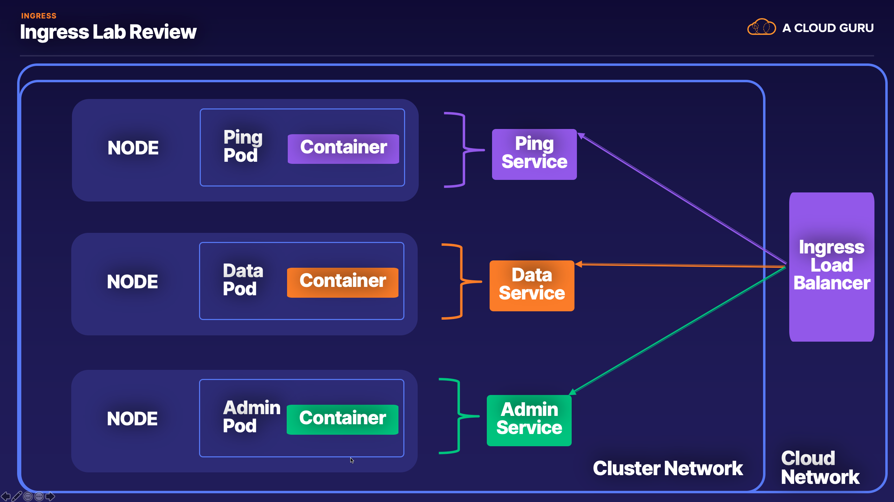

# Ingress Lab



### Objectives
1. Deploy EKS Cluster
2. Deploy Applications and Services 
3. Deploy NGINX Ingress Controller
4. Setup Ingress rules 
5. Test

### Prereq
1. Deploy an EKS Cluster 

### Setup Steps

### 1. Deploy EKS Cluster 

```bash
eksctl create cluster -N 3
```
```bash
[ℹ]  eksctl version 0.12.0
[ℹ]  using region us-west-2
[ℹ]  setting availability zones to [us-west-2c us-west-2d us-west-2b]
[ℹ]  subnets for us-west-2c - public:192.168.0.0/19 private:192.168.96.0/19
[ℹ]  subnets for us-west-2d - public:192.168.32.0/19 private:192.168.128.0/19
[ℹ]  subnets for us-west-2b - public:192.168.64.0/19 private:192.168.160.0/19
[ℹ]  nodegroup "ng-e7e094a6" will use "ami-0c13bb9cbfd007e56" [AmazonLinux2/1.14]
[ℹ]  using Kubernetes version 1.14
[ℹ]  creating EKS cluster "attractive-sculpture-1587846638" in "us-west-2" region with un-managed nodes
[ℹ]  will create 2 separate CloudFormation stacks for cluster itself and the initial nodegroup
[ℹ]  if you encounter any issues, check CloudFormation console or try 'eksctl utils describe-stacks --region=us-west-2 --cluster=attractive-sculpture-1587846638'
[ℹ]  CloudWatch logging will not be enabled for cluster "attractive-sculpture-1587846638" in "us-west-2"
[ℹ]  you can enable it with 'eksctl utils update-cluster-logging --region=us-west-2 --cluster=attractive-sculpture-1587846638'
[ℹ]  Kubernetes API endpoint access will use default of {publicAccess=true, privateAccess=false} for cluster "attractive-sculpture-1587846638" in "us-west-2"
[ℹ]  2 sequential tasks: { create cluster control plane "attractive-sculpture-1587846638", create nodegroup "ng-e7e094a6" }
[ℹ]  building cluster stack "eksctl-attractive-sculpture-1587846638-cluster"
[ℹ]  deploying stack "eksctl-attractive-sculpture-1587846638-cluster"
[ℹ]  building nodegroup stack "eksctl-attractive-sculpture-1587846638-nodegroup-ng-e7e094a6"
[ℹ]  --nodes-min=3 was set automatically for nodegroup ng-e7e094a6
[ℹ]  --nodes-max=3 was set automatically for nodegroup ng-e7e094a6
[ℹ]  deploying stack "eksctl-attractive-sculpture-1587846638-nodegroup-ng-e7e094a6"
[✔]  all EKS cluster resources for "attractive-sculpture-1587846638" have been created
[✔]  saved kubeconfig as "/Users/strongjz/.kube/config"
[ℹ]  adding identity "arn:aws:iam::363534682973:role/eksctl-attractive-sculpture-15878-NodeInstanceRole-8VILH6IFQH5S" to auth ConfigMap
[ℹ]  nodegroup "ng-e7e094a6" has 0 node(s)
[ℹ]  waiting for at least 3 node(s) to become ready in "ng-e7e094a6"
[ℹ]  nodegroup "ng-e7e094a6" has 3 node(s)
[ℹ]  node "ip-192-168-13-117.us-west-2.compute.internal" is ready
[ℹ]  node "ip-192-168-36-240.us-west-2.compute.internal" is ready
[ℹ]  node "ip-192-168-81-157.us-west-2.compute.internal" is ready
[ℹ]  kubectl command should work with "/Users/strongjz/.kube/config", try 'kubectl get nodes'
[✔]  EKS cluster "attractive-sculpture-1587846638" in "us-west-2" region is ready
```

### 2. Deploy Services

We are deploying Ping, Data, Admin Services

```bash
kubectl apply -f services-all.yml
```
```bash
service/ping-service configured
service/data-service configured
service/admin-service configured
```

Backing applications pods for Services

```bash
kubectl apply -f app.yml,database.yml
```
```bash
deployment.apps/app created
service/postgres created
configmap/postgres-config created
statefulset.apps/postgres created
```

Verify that services are working 

```bash 
kubectl exec -it dnsutils -- wget -qO- ping-service/host
{"message":"NODE: ip-192-168-13-117.us-west-2.compute.internal, POD IP:192.168.30.127"}

kubectl exec -it dnsutils -- wget -qO- ping-service/ping
{"message":"pong"}

kubectl exec -it dnsutils -- wget -qO- data-service/data
{"message":"Database Connected"}

kubectl exec -it dnsutils -- wget -qO- data-service/host
{"message":"NODE: ip-192-168-81-157.us-west-2.compute.internal, POD IP:192.168.83.48"}

kubectl exec -it dnsutils -- wget -qO- admin-service/host
{"message":"NODE: ip-192-168-36-240.us-west-2.compute.internal, POD IP:192.168.42.253"}
```


### 3. Deploy Ingress Controller

NGINX provides a yaml for deploying the Ingress Controller

```bash
kubectl apply -f nginx-ingress-controller.yml
```
```bash
kubectl apply -f nginx-ingress-controller.yml
namespace/ingress-nginx created
serviceaccount/ingress-nginx created
configmap/ingress-nginx-controller created
clusterrole.rbac.authorization.k8s.io/ingress-nginx created
clusterrolebinding.rbac.authorization.k8s.io/ingress-nginx created
role.rbac.authorization.k8s.io/ingress-nginx created
rolebinding.rbac.authorization.k8s.io/ingress-nginx created
service/ingress-nginx-controller-admission created
service/ingress-nginx-controller created
deployment.apps/ingress-nginx-controller created
validatingwebhookconfiguration.admissionregistration.k8s.io/ingress-nginx-admission created
clusterrole.rbac.authorization.k8s.io/ingress-nginx-admission created
clusterrolebinding.rbac.authorization.k8s.io/ingress-nginx-admission created
job.batch/ingress-nginx-admission-create created
job.batch/ingress-nginx-admission-patch created
role.rbac.authorization.k8s.io/ingress-nginx-admission created
rolebinding.rbac.authorization.k8s.io/ingress-nginx-admission created
serviceaccount/ingress-nginx-admission created
```

Let's Review what it is deploying 

- Namespace: ingress-nginx
- Service: Cluster IP
- Service: LoadBalancer
- Deployment: ingress-nginx-controller
- ClusterRole: ingress-nginx
- ClusterRoleBinding: ingress-nginx
- Role: ingress-nginx-admission
- RoleBinding: ingress-nginx-admission
- Job: ingress-nginx-admission-create
- Job: ingress-nginx-admission-patch
- ValidatingWebhookConfiguration: ingress-nginx-admission 

Let's Verify that everything is up and running 

```bash
kubectl get all --namespace ingress-nginx
```

```bash
NAME                                            READY   STATUS      RESTARTS   AGE
pod/ingress-nginx-admission-create-njfp7        0/1     Completed   0          110s
pod/ingress-nginx-admission-patch-sbl48         0/1     Completed   0          110s
pod/ingress-nginx-controller-5b9b698885-5jkt2   1/1     Running     0          2m1s

NAME                                         TYPE           CLUSTER-IP       EXTERNAL-IP                                                                     PORT(S)                      AGE
service/ingress-nginx-controller             LoadBalancer   10.100.240.117   a917eecbc873d11eaa1d606b2a3d6519-56d02fd4cb4ef6f7.elb.us-west-2.amazonaws.com   80:30496/TCP,443:30879/TCP   2m2s
service/ingress-nginx-controller-admission   ClusterIP      10.100.175.15    <none>                                                                          443/TCP                      2m3s

NAME                                       READY   UP-TO-DATE   AVAILABLE   AGE
deployment.apps/ingress-nginx-controller   1/1     1            1           2m2s

NAME                                                  DESIRED   CURRENT   READY   AGE
replicaset.apps/ingress-nginx-controller-5b9b698885   1         1         1       2m2s

NAME                                       COMPLETIONS   DURATION   AGE
job.batch/ingress-nginx-admission-create   1/1           4s         2m1s
job.batch/ingress-nginx-admission-patch    1/1           5s         2m1s
```

### 4. Setup ingress rules 

    kubectl apply -f ingress-rule.yml
Output

    ingress.extensions/ingress-resource configured

    kubectl describe ingress
    
    Name:             ingress-resource
    Namespace:        default
    Address:          a917eecbc873d11eaa1d606b2a3d6519-56d02fd4cb4ef6f7.elb.us-west-2.amazonaws.com
    Default backend:  default-http-backend:80 (<error: endpoints "default-http-backend" not found>)
    Rules:
      Host        Path  Backends
      ----        ----  --------
      *
                  /ping   ping-service:8080 
                  /data   data-service:8080
                  /admin   admin-service:8080
    Annotations:  kubernetes.io/ingress.class: nginx
                  nginx.ingress.kubernetes.io/ssl-redirect: false
    Events:
      Type    Reason  Age               From                      Message
      ----    ------  ----              ----                      -------
      Normal  CREATE  56s               nginx-ingress-controller  Ingress default/ingress-resource
      Normal  UPDATE  4s (x2 over 47s)  nginx-ingress-controller  Ingress default/ingress-resource
   
5. Test 
Get the external IP address of the Ingress Controller 

```bash
kubectl get ingress
NAME               HOSTS   ADDRESS                                                                         PORTS   AGE
ingress-resource   *       a917eecbc873d11eaa1d606b2a3d6519-56d02fd4cb4ef6f7.elb.us-west-2.amazonaws.com   80      33m
```

Ping Service

```bash
wget -qO- a917eecbc873d11eaa1d606b2a3d6519-56d02fd4cb4ef6f7.elb.us-west-2.amazonaws.com/ping/host
{"message":"NODE: ip-192-168-13-117.us-west-2.compute.internal, POD IP:192.168.30.127"}
```
```bash
wget -qO- a917eecbc873d11eaa1d606b2a3d6519-56d02fd4cb4ef6f7.elb.us-west-2.amazonaws.com/ping/ping
{"message":"pong"}
```

Data Service

```bash
wget -qO- a917eecbc873d11eaa1d606b2a3d6519-56d02fd4cb4ef6f7.elb.us-west-2.amazonaws.com/data/data
{"message":"Database Connected"}
```

```bash
wget -qO- a917eecbc873d11eaa1d606b2a3d6519-56d02fd4cb4ef6f7.elb.us-west-2.amazonaws.com/data/host
{"message":"NODE: ip-192-168-81-157.us-west-2.compute.internal, POD IP:192.168.83.48"}
```
Admin Service
```bash
wget -qO- a917eecbc873d11eaa1d606b2a3d6519-56d02fd4cb4ef6f7.elb.us-west-2.amazonaws.com/admin/host
{"message":"NODE: ip-192-168-36-240.us-west-2.compute.internal, POD IP:192.168.42.253"} 
```

Clean Up

Make sure to delete the Ingress Resource since it creates AWS Resources, and the EKS cluster

```bash
kubectl delete -f nginx-ingress-controller.yml
```
```bash
eksctl delete cluster --name attractive-sculpture-1587846638
```

